# cping

`cping` is `ping`, but cuter: one live terminal line, a little latency bar, and stats that update while you watch.



## Install

```sh
make
make install PREFIX=$HOME/.local
```

Or just run it:

```sh
make
./cping google.com
```

## What it Shows

```text
google.com [███████████░░░░░░░░░░░░░░░░░░░] 36.52 ms  sigma 2.71 ms  n=24  0.0% loss
```

- target host
- live latency bar
- latest round-trip time
- standard deviation
- successful sample count
- packet loss
- min/avg/max when your terminal is wide enough

## Cute Little Commands

Normal:

```sh
./cping google.com
```

ASCII-only, for terminals that are feeling shy:

```sh
./cping --ascii google.com
```

Stop after a few probes:

```sh
./cping -c 4 127.0.0.1
```

Save plain output:

```sh
./cping -c 2 127.0.0.1 > samples.txt
```

## Options

```text
Usage: cping [options] <host>
Options:
  -i, --interval <seconds>   Delay between probes, default 1.0
  -c, --count <number>       Stop after this many probes
  -m, --max-latency <ms>     Full-bar latency threshold, default 200
  -W, --timeout <seconds>    Per-probe timeout
      --ascii                Use ASCII bar characters
      --no-color             Disable terminal colors
  -4                         Force IPv4
  -6                         Force IPv6
  -h, --help                 Show help
  -v, --version              Show version
```

## How it Works

`cping` wraps your system `ping` command instead of doing raw ICMP itself. That keeps it portable across macOS and Linux, and it means you do not need to run it as root.

It reads `ping` output through a pipe, looks for the `time=` field, and updates the same terminal line. If stdout is redirected, it skips the terminal magic and prints one tidy sample per line.

The stats use Welford's algorithm, so `cping` can track average latency and sample standard deviation without saving every measurement.

The bar is just:

```text
current latency / max latency
```

By default, `200 ms` fills the whole bar. Change that with `--max-latency`.

## Build + Test

```sh
make
make test
make install PREFIX=$HOME/.local
```

## Demo

The README preview lives at `docs/demo.svg`. To record a fresh one:

```sh
make demo
```

You will need `asciinema` plus a renderer such as `agg`, `svg-term`, or `termtosvg`.

## License

MIT, babe. See [LICENSE](LICENSE).
